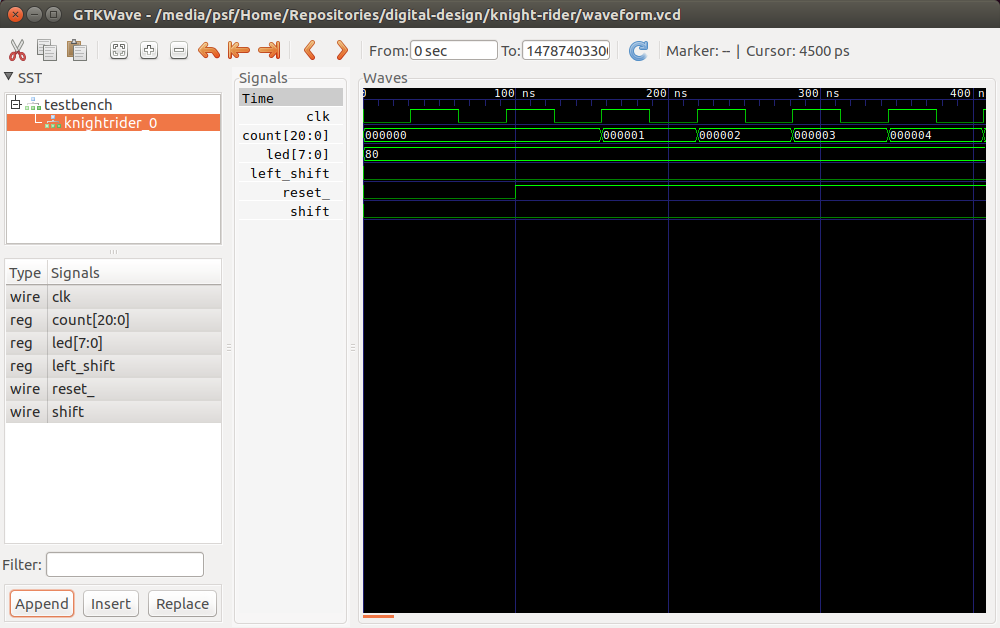

# Simulating a Design

This document describes how to simulate a Verilog design using Icarus Verilog and view the resulting VCD waveforms in GTKWave.

## Prerequisites

* Icarus Verilog simulator software ([installation instructions](install-instructions.md))

* GTKWave waveform viewer software ([installation instructions](install-instructions.md))

* A Verilog circuit design and testbench to simulate (such as any of the example projects).

## Simulating a Verilog design

Note that each of the sample projects already have Makefiles that will execute the simulator and produce a waveform output (via `make waveform`); this section is intended for those interested in the command-line details of Icarus Verilog.

Simulating a design with Icarus Verilog (and most other modern Verilog simulators, too) is a two-step process:

1. Cross-compile the Verilog design into an intermediate representation optimized for execution, and
2. Execute the simulation from the intermediate representation.

Icarus Verilog provides two command-line tools to achieve this process: `iverilog` and `vvp`.

#### Step 1: Compile the design

Use the `iverilog` command to compile your Verilog sources (including testbench and/or other test-related sources) into Icarus Verilog's internal representation, called VVP.

For example, the Knight Rider project has one RTL source file (`rtl/knightrider.v`) and one testbench file (`test/testbench.vt`). We can compile this to `simulation.vvp` using the command:

```
$ iverilog -o simulation.vvp rtl/knightrider.v test/testbench.vt
```

Note that the order of source files is unimportant. The testbench doesn't need be listed last, and there is no special switch or convention to specify which file represents the "top" of the design hierarchy (the tool will figure that out for itself).

Alternately, its possible to use the `-y` switch to tell `iverilog` to include all of the source files it finds in given directory. See the `man` page for details.

Icarus Verilog will produce no console output (unless it detects an error or warning) and will write the compiled output to `simulation.vvp`. With this, we're ready to execute the simulation.

#### Step 2: Execute the simulation

Use the `vvp` command to execute the simulation produced in the previous step:

```
$ vvp simulation.vvp
```

The simulation will produce whatever output is created by executing it (i.e., via `$display()` system tasks in the testbench) and will stop only when the `$finish` system task is executed or the simulator is stopped manually.

##### Stopping a simulation

To escape from a running simulation, interrupt the `vvp` process by typing `Ctrl-C` at the console. This will produce a simulator prompt, like:

```
** VVP Stop(0) **
** Flushing output streams.
** Current simulation time is 147874033 ticks.
> _
```

Then, type `$finish` at the prompt to exit the simulation (or type `Ctrl-D` to resume the simulation).

## Viewing waveform output

Be aware that waveform output is not automatically produced simply as a result of executing a simulation. The `$dumpvars()` system task (usually in conjunction with the `$dumpfile()` task) must be invoked for the simulator to generate a waveform (`.vcd`) file.

Start the GTKWave waveform viewer, with:

```
$ gtkwave
```

### Loading the waveforms

Load the waveform you created in simulation by choosing "File" -> "Open new Tab" and selecting the VCD file. Alternately, you can launch `gtkwave` with a waveform initially loaded by passing the name of the VCD file to `gtkwave` as an argument, like `$gtkwave waveform.vcd`.



Use the tree view in the upper-left corner (under "SST") to navigate your design hierarchy (that is, all of the Verilog modules in your circuit).

Clicking the name of any module in this tree view will list the signals defined in the module in the list below. Highlight signals in this list, then click "Append" to add them to the waveform view on the right.

### Navigation hints

Some helpful hints when using the waveform viewer:

* Use the + and - buttons in the toolbar to adjust the zoom. (By default, the waveform loads highly zoomed; you will likely need to zoom out several times).

* Highlight a signal in the waveform section and right-click on it to change its displayed format (if you wish to see values displayed in binary or decimal, for example).

* VCD files may be loaded incrementally. That is, the simulation does not have to be complete in order to start viewing the waveform. Use the blue circle-arrow button in the toolbar to refresh the file from disk to pick up new changes to the file.
