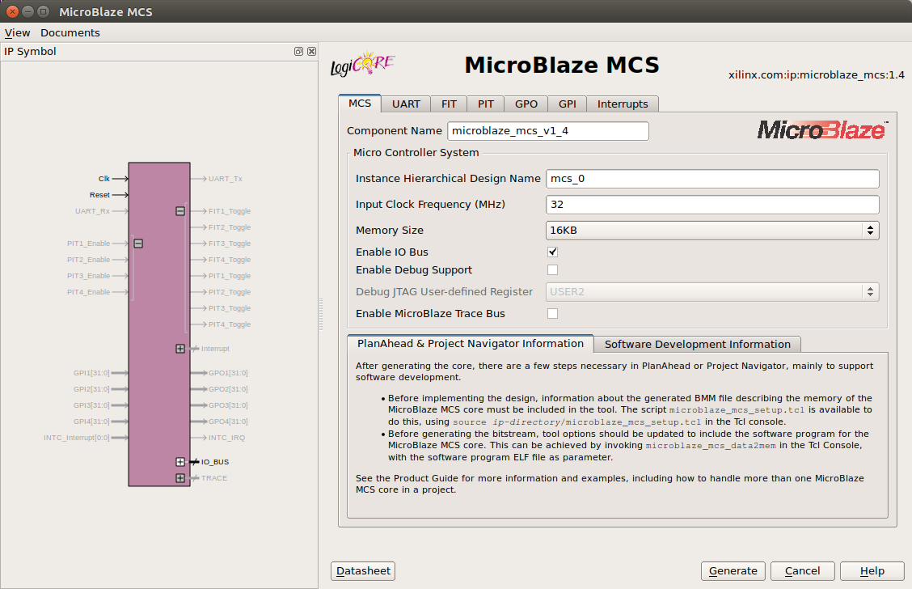

# LogicStart Microcontroller

This capstone project assembles elements from previous projects to create a microcontroller system that interacts with various components on the LogicStart MegaWing. When complete, we'll be able to write software that:

1. Controls the state of the eight LEDs.
2. Reads the state of the eight switches.
3. Controls all four of the seven-segment displays (with two different control modes).
4. Receives and transmits data over the RS-232 serial port interface.

Essentially, this is a series of improvements to the last project (Microblaze Microcontroller) that demonstrates how to interface our own Verilog modules with the CPU. We'll be generating another Microblaze CPU core for this project but configured slightly differently (to expose an IO bus).

Be sure you've successfully completed the Microblaze Microcontroller project and have a good sense of how the pieces fit together before starting this one. The instructions that follow are not as detailed as those in the previous project since many of these steps should now be familiar.

## Overview

Here are the steps we'll follow to complete our design:

2. [Generate the Microblaze CPU core](#create-the-microblaze-core)
3. [Create the firmware](#create-the-firmware)
4. [Run a simulation](#simulate) (of our hardware and software)
5. [Synthesize the design](#synthesize-the-design)
6. [Create the FPGA programming file](#create-the-programming-file)

## Step 1: Create the MicroBlaze Core

Use the `coregen` tool to create a MicroBlaze core just as you did in the previous project. Create and save the coregen project in the `core/` directory of this project.

This time, however, check the box to enable the IO bus signals. Do not enable any of the peripheral hardware (under the UART, FIT, PIT, GPO or GPI tabs) as we'll be integrating our own hardware in this project.



## Step 2: Create the Firmware

Use the Xilinx Software Development Kit (`xsdk`) to generate a firmware project, board support package, and hardware specification.

As you did in the last exercise, make the `src/` directory of this project the workspace in XSDK, then create a new "Application Project" called `firmware` (the previous project used the name `helloworld`, please note the change).

Copy the following code to the main source file (called `helloworld.c` by default):

```
/* --- GPIO Register Definitions --- */
#define GPIO_LED_CTRL       (*(volatile unsigned char *) 0xC0000000)
#define GPIO_SWITCH_CTRL    (*(volatile unsigned char *) 0xC0000001)

#define GPIO_DPAD_CTRL      (*(volatile unsigned char *) 0xC0000002)
#define   UP_PRESSED        ((unsigned char)0x80)
#define   DOWN_PRESSED      ((unsigned char)0x40)
#define   LEFT_PRESSED      ((unsigned char)0x20)
#define   RIGHT_PRESSED     ((unsigned char)0x10)
#define   UP_RELEASED       ((unsigned char)0x08)
#define   DOWN_RELEASED     ((unsigned char)0x04)
#define   LEFT_RELEASED     ((unsigned char)0x02)
#define   RIGHT_RELEASED    ((unsigned char)0x01)

/* --- Seven Segment Display Driver Register Definitions --- */
#define DISP_0_MODE_CTRL    (*(volatile unsigned char *) 0xD0000000)
#define DISP_0_VALUE_CTRL   (*(volatile unsigned char *) 0xD0000001)
#define DISP_1_MODE_CTRL    (*(volatile unsigned char *) 0xD0000002)
#define DISP_1_VALUE_CTRL   (*(volatile unsigned char *) 0xD0000003)
#define DISP_2_MODE_CTRL    (*(volatile unsigned char *) 0xD0000004)
#define DISP_2_VALUE_CTRL   (*(volatile unsigned char *) 0xD0000005)
#define DISP_3_MODE_CTRL    (*(volatile unsigned char *) 0xD0000006)
#define DISP_3_VALUE_CTRL   (*(volatile unsigned char *) 0xD0000007)

/* --- UART Register Definitions --- */
#define UART_TX_BYTE        (*(volatile unsigned char *) 0xE0000000)
#define UART_TX_BYTE_RDY    (*(volatile unsigned char *) 0xE0000001)
#define UART_RX_BYTE        (*(volatile unsigned char *) 0xE0000002)
#define UART_RX_BYTE_RDY    (*(volatile unsigned char *) 0xE0000003)
#define UART_TX_BYTE_CNT_HI (*(volatile unsigned char *) 0xE0000004)
#define UART_TX_BYTE_CNT_LO (*(volatile unsigned char *) 0xE0000005)
#define UART_RX_BYTE_CNT_HI (*(volatile unsigned char *) 0xE0000006)
#define UART_RX_BYTE_CNT_LO (*(volatile unsigned char *) 0xE0000007)

#define TX_BUFFER_SIZE 256
#define RX_BUFFER_SIZE 16

unsigned char txBuffer[TX_BUFFER_SIZE];	// Transmit circular buffer
unsigned char rxBuffer[RX_BUFFER_SIZE];	// Receive circular buffer
unsigned int txRdPtr = 0;				// Transmit buffer read pointer
unsigned int txWrPtr = 0;				// Transmit buffer write pointer
unsigned int rxWrPtr = 0;				// Receive buffer write pointer

unsigned char lastSwitchState;
unsigned int lastRxWrPtr;

/**
 * Places a byte into the UART transmit queue.
 */
void enqueueByteForTx (unsigned char c) {
	txBuffer[txWrPtr] = c;
	txWrPtr = (txWrPtr + 1) % TX_BUFFER_SIZE;
}

/**
 * Places a string into the UART transmit queue.
 */
void enqueueStringForTx (char* string) {
	int index = 0;
	while (string[index] != '\0') {
		enqueueByteForTx(string[index++]);
	}
}

/**
 * Sends a single byte from the transmit queue to the UART; receives
 * a single byte from the UART and places it in the receive queue.
 *
 * Call this routine each time through the main loop to service UART
 * IO.
 */
void serviceUart () {
	// If transmitter isn't busy and there's a byte to transmit, then transmit it
	while (txRdPtr != txWrPtr) {
		if (UART_TX_BYTE_RDY) {
			UART_TX_BYTE = txBuffer[txRdPtr];
			txRdPtr = (txRdPtr + 1) % TX_BUFFER_SIZE;
		}
	}

	// If the receiver has a byte for us, pull it into the buffer
	if (UART_RX_BYTE_RDY) {
		rxBuffer[rxWrPtr] = UART_RX_BYTE;
		rxWrPtr = (rxWrPtr + 1) % RX_BUFFER_SIZE;

		UART_RX_BYTE_RDY = 0xff;	// Clear the ready indicator
	}
}

unsigned char peekRxByte(int offset) {
	int index = rxWrPtr - (offset + 1);		// Last rx byte is 1 before current ptr

	if (index < 0) {
		index = RX_BUFFER_SIZE - 1 - index;
	}

	return rxBuffer[index];
}

/**
 * Returns the total number of bytes transmitted from the UART to the
 * host computer.
 */
unsigned int getTxByteCount () {
	return (unsigned int)(UART_TX_BYTE_CNT_HI << 8 | UART_TX_BYTE_CNT_LO);
}

/**
 * Returns the total number of bytes received from the host computer.
 */
unsigned int getRxByteCount () {
	return (unsigned int)(UART_RX_BYTE_CNT_HI << 8 | UART_RX_BYTE_CNT_LO);
}

int main () {

	lastSwitchState = GPIO_SWITCH_CTRL;
	lastRxWrPtr = rxWrPtr;

	enqueueStringForTx("** Welcome to LogicStart Firmware **\n");

	while(1) {
		serviceUart();

		// Display number of bytes received on 7-segment display
		DISP_0_VALUE_CTRL = getRxByteCount() / 1 % 10;
		DISP_1_VALUE_CTRL = getRxByteCount() / 10 % 10;
		DISP_2_VALUE_CTRL = getRxByteCount() / 100 % 10;
		DISP_3_VALUE_CTRL = getRxByteCount() / 1000 % 10;

		// Send d-pad button press events to host computer
		if (GPIO_DPAD_CTRL & UP_PRESSED)     enqueueStringForTx("Up Pressed\n");
		if (GPIO_DPAD_CTRL & DOWN_PRESSED)   enqueueStringForTx("Down Pressed\n");
		if (GPIO_DPAD_CTRL & LEFT_PRESSED)   enqueueStringForTx("Left Pressed\n");
		if (GPIO_DPAD_CTRL & RIGHT_PRESSED)  enqueueStringForTx("Right Pressed\n");
		if (GPIO_DPAD_CTRL & UP_RELEASED)    enqueueStringForTx("Up Released\n");
		if (GPIO_DPAD_CTRL & DOWN_RELEASED)  enqueueStringForTx("Down Released\n");
		if (GPIO_DPAD_CTRL & LEFT_RELEASED)  enqueueStringForTx("Left Released\n");
		if (GPIO_DPAD_CTRL & RIGHT_RELEASED) enqueueStringForTx("Right Released\n");
		GPIO_DPAD_CTRL = 0x00;	// Clear sampled events

		// Send switch state change events to host computer
		if (GPIO_SWITCH_CTRL != lastSwitchState) {
			lastSwitchState = GPIO_SWITCH_CTRL;

			enqueueStringForTx("Switch State Change: ");
			enqueueStringForTx((lastSwitchState & 0x02) ? "[ON ] " : "[OFF] ");
			enqueueStringForTx((lastSwitchState & 0x04) ? "[ON ] " : "[OFF] ");
			enqueueStringForTx((lastSwitchState & 0x08) ? "[ON ] " : "[OFF] ");
			enqueueStringForTx((lastSwitchState & 0x10) ? "[ON ] " : "[OFF] ");
			enqueueStringForTx((lastSwitchState & 0x20) ? "[ON ] " : "[OFF] ");
			enqueueStringForTx((lastSwitchState & 0x40) ? "[ON ] " : "[OFF] ");
			enqueueStringForTx((lastSwitchState & 0x80) ? "[ON ]\n" : "[OFF]\n");
		}

		// If we received a byte over the UART...
		if (rxWrPtr != lastRxWrPtr) {
			lastRxWrPtr = rxWrPtr;

			// ... and the second to last byte received is an 'L'...
			if (peekRxByte(1) == 'L') {

				// ... then toggle the LED associated with number received last
				if (peekRxByte(0) == '0') GPIO_LED_CTRL ^= 0x01;
				if (peekRxByte(0) == '1') GPIO_LED_CTRL ^= 0x02;
				if (peekRxByte(0) == '2') GPIO_LED_CTRL ^= 0x04;
				if (peekRxByte(0) == '3') GPIO_LED_CTRL ^= 0x08;
				if (peekRxByte(0) == '4') GPIO_LED_CTRL ^= 0x10;
				if (peekRxByte(0) == '5') GPIO_LED_CTRL ^= 0x20;
				if (peekRxByte(0) == '6') GPIO_LED_CTRL ^= 0x40;
				if (peekRxByte(0) == '7') GPIO_LED_CTRL ^= 0x80;
			}
		}
	}

	return 0;
}
```

## Step 3: Simulate

Run the simulation by invoking the Makefile in the project directory:

```
$ make
```

The testbench does not actually verify any portion of the design; it merely provides a clock and reset input to the chip and generates a waveform output.

Ideally, we'd have some test firmware that could run in simulation to validate the design. This is an exercise left to the interested student.

## Synthesize the design

Start the Xilinx ISE Design Suite tool (`ise`) and create a new project in the `ise/` subdirectory of this project. As per usual, configure the target device to match the Papilio's Xilinx FPGA.

Then, add all of the required sources to the project:
* All the Verilog sources in this project's `rtl/` directory.
* The MicroBlaze core you generated in a previous step (`core/microblaze_mcs_v1_4.xco`)
* The debouncer module (`debouncer.v`) from the `konami-acceptor/rtl` directory.
* The UART design files (`uart.v`, `rx.v`, and `tx.v`) from the `uart/rtl` directory
* The seven-segment display driver and coder (`displaydriver.v` and `bcdcoder.v`) from the `seven-segment-counter/rtl` directory
* And finally, this project's user constraints file (`papilio/papilio-pro.ucf`)

Execute the "Generate Programming File" process to implement the design and generate a bitstream programming file.

## Burn the firmware into the programming file

Recall that the bitstream programming file generated above does not contain our firmware embedded in it. We need to execute `data2mem` to create a derived bitstream file containing our software.

From the top-level of this project directory, execute:

```
$ data2mem -bm core/microblaze_mcs_v1_4_bd.bmm -bd src/firmware/Debug/firmware.elf -bt ise/lsuc_top.bit -o b ise/lsuc-firmware.bit
```

This will generate a derived bitstream (`ise/lsuc-firmware.bit`) which can now be loaded onto the Papilio via:

```
$ sudo papilio-prog -f ise/lsuc-firmware.bit
```
