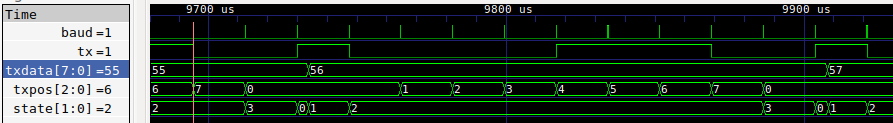

# RS-232 Universal Asynchronous Receiver / Transmitter

This project implements a [universal asynchronous receiver/transmitter](https://en.wikipedia.org/wiki/Universal_asynchronous_receiver) (UART) that echoes received data back to the transmitter.

Of course, echoing serial communication is as simple as connecting the transmit (`tx`) signal back to the receive (`rx`); that is not what this project does. This project fully "deserializes" the incoming data by taking the bits, each transmitted one-by-one over the wire, and converting the stream into a byte. This deserialized byte is then "looped back" into the UART to be re-serialized into a stream of bits and sent back.

#### Theory of operation

The Papilio development board contains a dual-port USB serial port (provided by the [FTDI FT2232D chip](http://www.ftdichip.com/Support/Documents/DataSheets/ICs/DS_FT2232D.pdf)). This serial port is used by the `papilio-prog` tool to load Xilinx `.bit` files onto the FPGA, but can also be used to implement serial data communication between the FPGA and a host computer. The FTDI chip lets our circuit remain unaware of the USB protocol and all the complexity associated with it; we can simply send and receive data to/from the host computer via the much simpler [RS-232 serial communications standard](https://en.wikipedia.org/wiki/RS-232).

The result of this being that we can connect the Papilio to a computer via USB, open a serial communications app (like PuTTY, miniterm or cutecom), send bytes over the USB serial port, and see them echoed back to us. [Detailed instructions below.](#testing-serial-communications)  

#### Overview of RS-232 serial communications

The waveforms below illustrate what RS-232 serial communication looks like "over the wire":



Signal | Description
-------|---------------
`tx`   | Serial data transmitted from the FPGA to the FTDI USB controller chip (an output pin on the FPGA; an input pin on the FTDI). While an `rx` signal is not illustrated, the data format would be identical.
`baud` | A pulse (the width of a single clock cycle) generated at the baud frequency (115,200 times per second, in this case).
`txdata` | The byte of data the UART is in the process of serializing and transmitting.
`txpos` | The position of the bit currently being transmitted. Note that this value appears to precede the transmit data by one baud pulse; that's normal behavior. See if you can figure out why.
`state` | The state of the transmitter. `2'd0` is idle; `2'd1` is start; `2'd2` is transmit data; and `2'd3` is transmit stop. Like `txpos`, this value appears to precede `tx` by one `baud` pulse.

Lets take a look at what's happening to the transmit output (`tx`) when the transmitter is sending `8'd56`:

* First, take note that changes to the value of `tx` are aligned with `baud`. This is the very definition of baud: The maximum rate at which our transmit data signal can change state.
* The first high pulse (right above where `txdata` transitions from `55` to `56`) is the last transmission's stop bit. The 1 value provides a delineation between the previous transmissions's stop bit and the beginning this transmission. In this example, we're transmitting bytes back-to-back without any delay. Had there been some period of time between the previous transmission (`55`) and this one (`56`), we'd see that `tx` remains high for the duration of the idle period.
* Our transmission starts with the 0 value directly following the stop bit. This is considered the "start bit" and delineates the end of the idle period between transmissions.
* The value of `tx` for the next eight baud pulses represent  each bit of the transmit data starting with the least significant bit (`txdata[0]`) and ending with the most significant bit (`txdata[7]`). In sequence, we see the transmit pattern 0-0-0-1-1-1-0-0 (the bit pattern for decimal 56, LSB to MSB).
* Finally, we see a 1 value representing our transmission's stop bit. The patterns repeats from here.

#### Testing Serial Communications

The UART implemented in this circuit is intended to communicate with the host PC using these settings:

* **Baud**: 115,200
* **Parity**: None
* **Handshaking**: None (neither hardware or software)
* **Stop Bits**: 1
* **Data Bits**: 8

1. Start by connecting the Papilio to your host computer via USB and loading the `loopback.bit` Xilinx file to it.

2. The USB chip on the Papilio will _enumerate_ itself as two serial ports. Identify the Linux device associated with the second port. On Linux, we can grep `dmesg` for this information (you'll note in this example that our device is `ttyUSB1`):
```
root@ubuntu-vm-i386:# dmesg | grep tty
[    0.000000] console [tty0] enabled
[ 9715.923563] usb 2-1: FTDI USB Serial Device converter now attached to ttyUSB0
[ 9715.927584] usb 2-1: FTDI USB Serial Device converter now attached to ttyUSB1
[ 9738.389022] ftdi_sio ttyUSB0: FTDI USB Serial Device converter now disconnected from ttyUSB0
[10364.012161] ftdi_sio ttyUSB1: FTDI USB Serial Device converter now disconnected from ttyUSB1
```

3. Install `cutecom` (available on Linux and macOS) using `sudo apt install cutecom`. (Other tools like Putty will suffice, too.)

4. Open the terminal application as superuser (without superuser permission, you won't be able to access the serial port hardware) using the command `sudo cutecom`

5. Open a connection to the Papilio using the serial device you identified in the last step, and configured using the baud, parity, stop bits, and data bits shown above.

6. Transmit some text over the serial port; witness the same text echoed back.

#### Suggested modifications

* (Easy) Modify the baud rate of the serial communications from 115,200 to some other value (like 57,600).
* (Harder) Change the transmit and receive modules to support other communication modes (like parity and/or a different number of stop bits or data bits). Extra credit: Make these changes compile-time options with the Verilog `parameter` directive.

## Makefile

Target       | Description
-------------|------------
`waveform`   | Executes the Verilog simulation producing a VCD waveform as output: `waveform.vcd`.
`clean`      | Removes generated files produced by the `compile`, `simulate` and `synthesize` targets.

## Design files in this project

File | Description
-----|------------
[`rtl/loopback.v`](rtl/loopback.v) | Top-level module; instantiates a UART configured for loopback (that is, echoing received data back to sender).
[`rtl/uart.v`](rtl/uart.v) | UART circuit for serializing/deserializing data from the FTDI USB chip.
[`rtl/tx.v`](rtl/tx.v) | UART transmiter module.
[`rtl/rx.v`](rtl/rx.v) | UART receiver module.
[`test/testbench.v`](test/testbench.v) | Circuit test bench.
[`papilio/papilio-pro.ucf`](papilio/papilio-pro.ucf) | User constraints file providing a mapping of logical ports (defined in Verilog) to physical pins on the FPGA.
